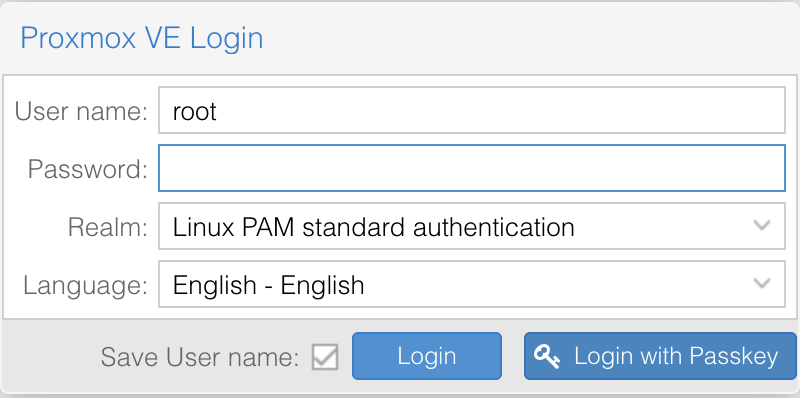

# pve-webauthn-login



WebAuthn passwordless login for Proxmox VE. Enables TouchID, Windows Hello, hardware security keys, and other passkey authenticators as a standalone login method, bypassing password entry.

Designed for home server environments where you want the security of authenticated access to the Proxmox UI without the friction of typing passwords.

> **⚠️ Warning:** This package is not intended for production environments. It modifies Proxmox authentication behavior through monkey-patching and auto-updates daily from GitHub. While we make a best effort to keep the supply chain secure (GPG-signed releases, signature verification), the auto-update mechanism should be considered medium risk. No guarantees are made regarding fitness for any purpose. Use at your own risk.

## Features

- **Passwordless authentication** using WebAuthn/FIDO2
- **Support for** TouchID, Windows Hello, YubiKey, and other security keys
- **No modification to Proxmox system files**
- **Easy installation** via install script or Debian package
- **Auto-updates** via daily systemd timer
- **Graceful degradation** - designed to allow Proxmox to run normally if the module fails to load

## Requirements

- Proxmox VE 8.4.14 or 9.1.2 (see [COMPATIBILITY.md](COMPATIBILITY.md) for tested versions)
- WebAuthn must be configured in Datacenter options
- User must have a WebAuthn credential registered (via Two Factor settings)

## Installation

Run on your Proxmox server:

```bash
bash -c "$(curl -fsSL https://raw.githubusercontent.com/chall37/pve-webauthn-login/main/install.sh)"
```

The script automatically detects your Proxmox version and installs the correct package.

### Manual installation

Download the .deb for your Proxmox version from [GitHub Releases](https://github.com/chall37/pve-webauthn-login/releases):

```bash
wget https://github.com/chall37/pve-webauthn-login/releases/download/v2025.12.4/pve-webauthn-login_2025.12.4_all.deb
dpkg -i pve-webauthn-login_2025.12.4_all.deb
```

### Building from source

```bash
git clone https://github.com/chall37/pve-webauthn-login.git
cd pve-webauthn-login
dpkg-buildpackage -us -uc -b
dpkg -i ../pve-webauthn-login_*.deb
```

## Usage

1. **Configure WebAuthn** in Proxmox:
   - Go to Datacenter → Options → WebAuthn Settings
   - Set the Relying Party, Origin, and ID to match your Proxmox URL

2. **Register a WebAuthn credential** for your user:
   - Go to Datacenter → Permissions → Two Factor
   - Add → WebAuthn
   - Follow the prompts to register your TouchID/security key

3. **Login with Passkey**:
   - On the login page, enter your username
   - Click "Login with Passkey"
   - Authenticate with TouchID/security key

## How It Works

This package installs:

- A Perl module that registers new API endpoints for passwordless WebAuthn login
- JavaScript that adds a "Login with Passkey" button to the login form
- Wrapper scripts that load the module before pveproxy/pvedaemon start

The wrappers use `dpkg-divert` to intercept the original binaries. No Proxmox system files are modified directly.

## Auto-Updates

This package includes a daily systemd timer that automatically checks for and installs updates. The update process:
- Validates the release tag format
- Checks compatibility with your Proxmox version
- Downloads the .deb package and GPG signature from releases
- Verifies the GPG signature matches the expected fingerprint
- Only installs after all checks pass

> **Note:** Failing to keep this package updated alongside Proxmox point releases may break your installation. If you disable auto-updates, you are responsible for manually updating when Proxmox is upgraded.

To check timer status:
```bash
systemctl status pve-webauthn-login-update.timer
```

To manually trigger an update check:
```bash
systemctl start pve-webauthn-login-update.service
```

### Disabling Auto-Updates

To disable automatic updates:
```bash
systemctl disable --now pve-webauthn-login-update.timer
```

To re-enable:
```bash
systemctl enable --now pve-webauthn-login-update.timer
```

You can also install with auto-updates disabled from the start:
```bash
curl -fsSL https://raw.githubusercontent.com/chall37/pve-webauthn-login/main/install.sh | bash -s -- --no-auto-update
```

## Upgrades

If a new Proxmox version introduces breaking API changes, the module is designed to fail gracefully, allowing Proxmox to run normally without passkey login. The auto-update timer will attempt to install a compatible version when one becomes available.

## Troubleshooting

If the passkey button disappears or stops working:

1. **Check syslog for errors:**
   ```bash
   grep pve-webauthn-login /var/log/syslog
   ```

2. **Verify services are running:**
   ```bash
   systemctl status pveproxy pvedaemon
   ```

3. **Run the install script** to check for updates:
   ```bash
   bash -c "$(curl -fsSL https://raw.githubusercontent.com/chall37/pve-webauthn-login/main/install.sh)"
   ```

The module is designed to fail gracefully, allowing Proxmox to run normally without passkey login if loading fails.

## Uninstallation

```bash
apt remove pve-webauthn-login
```

## Security

### Authentication
- WebAuthn challenges include a 60-second timeout
- Challenge tickets are cryptographically signed with Proxmox's RSA key
- Only users with registered WebAuthn credentials can use this flow
- User must exist and be enabled in Proxmox
- Origin verification is handled by the WebAuthn standard
- All authentication attempts are logged

### Package Integrity
- All releases are GPG-signed
- Both install.sh and the auto-update script verify signatures before installation
- GPG key fingerprint is hardcoded to prevent key substitution attacks
- Public key is distributed in the repository ([keys/pve-webauthn-login.asc](keys/pve-webauthn-login.asc))
- Auto-updates download from releases (not main branch) with full signature verification

## License

MIT License - see [LICENSE](LICENSE) for details.

## Contributing

Pull requests welcome! Please open an issue first to discuss proposed changes.
